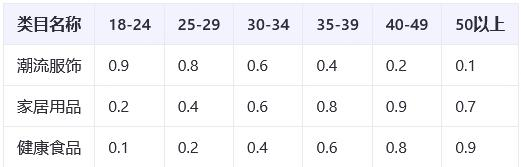
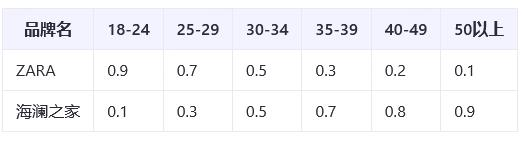

1. 基础特征包括年龄、性别、年代、身高、体重、星座 6 类标签
   1.1 年龄计算 ->先取 baseLine 的数据 user_info. Birthday, 加权计算 order_info. User_id = user_info. Id 订单表和用户表的关联关系
   类目偏好 yes
   品牌偏好 no
   价格区间 yes total amount
   时间行为 yes create_time
   搜索词 no
   社交互动行为 no
   设备信息 yes

-----------
#### 用户年龄标签
维度: 年龄: 18-24 岁、25-29 岁、30-34 岁、35-39 岁、40-49 岁、50 岁以上 -->join 数据, 使用 case end 做年龄段处理
数据来源：淘宝平台用户行为日志数据（包括但不限于点击、浏览、搜索、收藏、加购、下单、支付、商品评价等）、商品类目属性数据
判断条件：  --固定数值
    类目偏好  --根据用户浏览类目与预设年龄偏好系数的加权得分
    
    品牌偏好  --根据用户购买品牌与预设年龄偏好系数的加权得分
    
	价格敏感度 --用户对价格敏感行为的加权得分（如搜索“折扣”“优惠”等关键词的频率）
	时间行为 --用户活跃时间段与年龄段的匹配得分（如夜间活跃可能偏向年轻用户）
		凌晨：00:00 - 05:59
		早晨：06:00 - 08:59
		上午：09:00 - 11:59
		中午：12:00 - 13:59
		下午：14:00 - 17:59
		晚上：18:00 - 21:59
		夜间：22:00 - 23:59
	搜索词分析
		时尚与潮流：“潮流”、“新款”、“时尚”等。
		性价比：“优惠”、“折扣”、“便宜”等。
		健康与养生：“健康食品”、“保健品”、“养生”等。
		家庭与育儿：“婴儿用品”、“儿童玩具”、“亲子活动”等。
		科技与数码：“智能手机”、“电脑配件”、“智能设备”等。
		学习与发展：“在线课程”、“书籍”、“技能提升”等。
	社交互动行为
	设备信息
Userid
username
gender 1
gender 2
briday
niandai
Height
Weight
xingzuo